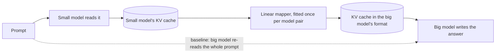

# kvtransfer

**Let a bigger LLM pick up where a smaller one left off, without re-reading the prompt.**

An independent, from-scratch implementation of the NVIDIA paper
[*Cross-Model KV Cache Transfer in LLM Families: A Closed-Form Linear Mapping for Prefill Reuse*](https://arxiv.org/abs/2608.03893)
(Heo et al., arXiv:2608.03893, August 2026), with the paper's full evaluation protocol and
results measured on real models on a single NVIDIA DGX Spark.

The paper released no code. This repository rebuilds the method from its equations, verifies it
with 99 tests, and reports what it actually delivers on two model pairs.

| | |
|---|---|
| **Paper** | Heo et al., NVIDIA, [arXiv:2608.03893](https://arxiv.org/abs/2608.03893) |
| **This repository** | A complete implementation: library, command line, experiment runner, accuracy harness, escalation server |
| **Stack** | PyTorch, Hugging Face `transformers`, lm-evaluation-harness |
| **Hardware used** | One NVIDIA DGX Spark (GB10, 128 GB unified memory) |
| **Model pairs tested** | Qwen3-4B → Qwen3-8B and Qwen3-1.7B → Qwen3-8B |
| **Headline results** | 95.4 % and 86.4 % accuracy retention; mapping is about 2× faster than re-reading the prompt |
| **Tests** | 99 offline tests, about 10 seconds on CPU |

## Contents

1. [The problem](#the-problem)
2. [The paper's idea](#the-papers-idea)
3. [What this repository implements](#what-this-repository-implements)
4. [Results](#results)
5. [Quick start](#quick-start)
6. [Running on an NVIDIA DGX Spark](#running-on-an-nvidia-dgx-spark)
7. [Repository layout](#repository-layout)
8. [Not implemented yet](#not-implemented-yet)
9. [Citation and license](#citation-and-license)

## The problem

An LLM writes one token at a time, and for every token it looks back at everything it has read.
To avoid re-reading the prompt each time, it saves its internal notes on every token once. Those
notes are the **KV cache**. Building them is called **prefill**, and it is the slowest step before
the first word of an answer appears.

The notes are private to the model that wrote them. So in a system that tries a small model first
and escalates hard requests to a bigger one, the big model throws the small model's notes away and
reads the whole prompt again. The slowest step is paid twice.

## The paper's idea

Translate the small model's notes into the big model's format, so the big model can skip prefill.



The translator is deliberately simple, with no neural network training:

1. **Calibrate once per model pair.** Run both models over the same 500 text passages and collect
   statistics of their KV caches.
2. **Pick source layers.** For each layer of the target model, choose the `k` source layers that
   predict it best.
3. **Fit a linear map per attention head** with ridge regression, solved in closed form.
4. **At run time**, remove the positional rotation (RoPE) from the source keys, apply the map, and
   re-apply the target's rotation. Values are mapped directly. The target then decodes from the
   mapped cache.

What the paper reports:

| | Paper |
|---|---|
| Accuracy retention | 73–98 % on four of its six model pairs |
| Speed | Mapping is 2.7–25× faster than re-prefill (Qwen3 14B → 32B at 32K tokens: 278 ms against 6,975 ms) |
| Hardware | 8 × H100 |
| Code | Not released |

The method applies when the two models are from the same family, share a tokenizer, and have the
same KV head count and head size (for example all of Qwen3 0.6B to 32B, Llama 3.1 8B and 70B).
Depth and width may differ.

## What this repository implements

| Piece | What it does | Where |
|---|---|---|
| Ridge mapper | Streaming calibration statistics, closed-form per-head ridge, top-k layer selection | `ridge.py`, `select.py`, `calibration.py`, `mapper.py` |
| RoPE handling | Strips and re-applies each model's own rotary embedding exactly | `rope.py` |
| Transfer runtime | Source prefill → map → target decode, multi-turn switching in both directions | `transfer.py` |
| Diagnostics | Held-out R², attention-output cosine, logit KL, next-token agreement | `metrics.py` |
| Experiment runner | The paper's whole protocol in one resumable command, with a written report | `experiment.py` |
| Accuracy harness | lm-evaluation-harness adapter: source, target and transfer accuracy with retention | `lm_eval_adapter.py` |
| Latency benchmark | Mapper against target re-prefill across prompt lengths | `bench.py` |
| Escalation server | Small model answers, big model continues from the mapped cache | `serve.py` |
| Fleet tools | Which of your local models can be paired, and whether a pair fits in memory | `discover.py`, `catalog.py`, `hardware.py` |
| DGX Spark tooling | Thermal governor, memory and temperature watchdog, detached launcher, telemetry | `thermal.py`, `scripts/dgx_spark/` |

Every claim in the paper is mapped to the code and to the test that checks it in
[`docs/PAPER_VERIFICATION.md`](docs/PAPER_VERIFICATION.md). The tests prove, among other things,
that an identity pair reproduces a model's own outputs exactly, including at prompt lengths beyond
the calibration length.

## Results

Two model pairs were run through the full protocol. Details are in
[`docs/RESULTS_TIER1.md`](docs/RESULTS_TIER1.md) and
[`docs/RESULTS_GAP_PAIR.md`](docs/RESULTS_GAP_PAIR.md).

### Setup

| | Pair A | Pair B |
|---|---|---|
| Small → big model | Qwen3-4B-Instruct-2507 → Qwen3-8B | Qwen3-1.7B → Qwen3-8B |
| Layers | 36 → 36 | 28 → 36 |
| Why this pair | Closest match to the paper's setting | The small model is clearly weaker, so there is a quality gap to preserve |
| Calibration data | 500 passages × 1,024 tokens of FineWeb-Edu (educational web text) | same |
| Held-out check | 32 unseen passages: 992 mapped tokens, then 32 tokens decoded by the big model | same |
| Accuracy benchmarks | ARC-Challenge, HellaSwag, WinoGrande, first 500 questions each | same |
| Best `k` found | 12 | 10 |
| Hardware and run time | One DGX Spark, about 5 hours | One DGX Spark, about 3 hours |

### Headline numbers

| Measure | Pair A: 4B → 8B | Pair B: 1.7B → 8B |
|---|---:|---:|
| **Accuracy retention** (transfer ÷ big model alone) | **95.4 %** | **86.4 %** |
| Floor-normalized retention | 91.5 % | 71.2 % |
| Next-token agreement with the big model's own cache | 87.1 % | 80.3 % |
| Same agreement with no transfer at all | 75.0 % | 59.4 % |
| Attention-output cosine | 0.899 | 0.880 |
| Logit KL divergence | 0.090 | 0.261 |
| **Speed against re-reading the prompt** | **2.0×** | **2.0–2.2×** |
| Big → small direction, next-token agreement | 87.4 % | 80.1 % |
| Drift over 10 alternating handoffs | none | none |

### Accuracy on the benchmarks

Share of questions answered correctly. "Transfer" is the big model answering from the small
model's translated cache. The margin of error is about ±2 points per cell.

| Benchmark | Pair A: small / big / transfer | Retention | Pair B: small / big / transfer | Retention |
|---|---|---:|---|---:|
| ARC-Challenge | 56.2 / 55.8 / 54.0 | 96.8 % | 43.2 / 55.8 / 46.6 | 83.5 % |
| HellaSwag | 58.0 / 64.2 / 58.2 | 90.7 % | 53.4 / 64.2 / 53.6 | 83.5 % |
| WinoGrande | 70.0 / 68.4 / 67.6 | 98.8 % | 60.4 / 68.4 / 63.0 | 92.1 % |
| **Average** | | **95.4 %** | | **86.4 %** |

### Speed

Time for the big model to be ready to answer: mapping the small model's cache, against reading the
prompt itself.

| Prompt length | Pair A: map / re-read | Speedup | Pair B: map / re-read | Speedup |
|---:|---|---:|---|---:|
| 64 tokens | 27.9 ms / 78.4 ms | 2.8× | 24.4 ms / 77.2 ms | 3.2× |
| 1,024 tokens | 148.5 ms / 261.7 ms | 1.8× | 126.2 ms / 258.2 ms | 2.0× |
| 2,048 tokens | 300.7 ms / 588.0 ms | 2.0× | 254.9 ms / 573.5 ms | 2.2× |
| 8,192 tokens | 1,249 ms / 2,447 ms | 2.0× | 1,212 ms / 2,425 ms | 2.0× |

### Choosing `k`

Held-out attention-output cosine as more source layers feed each target layer. Quality peaks at a
moderate `k` and falls when every layer is used, although the in-sample fit keeps improving. The
paper found the same shape.

| `k` | 1 | 4 | 8 | 10 | 12 | 16 | 20 | all |
|---|---:|---:|---:|---:|---:|---:|---:|---:|
| Pair A | 0.824 | 0.881 | 0.890 | 0.889 | **0.899** | 0.896 | 0.879 | 0.744 |
| Pair B | 0.679 | 0.860 | 0.876 | **0.880** | 0.873 | 0.862 | 0.851 | 0.694 |

### Is every part of the method needed?

Removing one component at a time, at the best `k`. Each cell is attention cosine / KL divergence.

| Variant | Pair A | Pair B |
|---|---|---|
| Full method | 0.899 / 0.090 | 0.880 / 0.261 |
| Without re-applying the rotation | 0.762 / 0.753 | 0.740 / 0.992 |
| Fitted on rotated keys instead | 0.871 / 0.220 | 0.873 / 0.302 |
| Rotated keys and a single source layer | 0.791 / 0.363 | 0.659 / 0.908 |

Skipping the rotation step is worse than not transferring at all, exactly as the paper warns.

### How this compares with the paper

| Paper's finding | Measured here | Verdict |
|---|---|---|
| 73–98 % accuracy retention on working pairs | 95.4 % and 86.4 % | Reproduced |
| Best `k` is moderate (8 and 12 on its Qwen3 pairs) | 12 and 10 | Reproduced |
| Correct RoPE handling is essential | Quality collapses without it | Reproduced |
| In-sample fit does not predict transfer quality | Fit improves while held-out quality falls at large `k` | Reproduced |
| Big → small transfer works | Works on both pairs | Reproduced |
| Little drift across multi-turn handoffs | No measurable drift | Reproduced |
| Mapping is 2.7–25× faster than re-prefill | About 2× | Lower here: the 8B target is cheap to re-read, and these mappers use 10 to 12 source layers |

### What the results mean

**What works.** The method does what the paper describes. A closed-form linear map, fitted in
minutes with no gradient training, lets the larger model decode from the smaller model's cache,
keeps 86 to 95 % of its benchmark accuracy, and is ready to answer in about half the time. The
whole protocol runs end to end on a single desktop-class machine.

**What to read carefully.** Retention divides the transfer score by the big model's score. It does
not show how well the small model would have done alone. In Pair B the small model on its own
already reaches 83 % of the big model's accuracy, and the transfer recovers about a fifth of the
gap between them (27 %, 2 % and 33 % on the three benchmarks). The big model decoding from a
translated cache scores closer to the small model than to itself. Pair A could not show this,
because its two models are level on two of the three benchmarks.

**Why this may be the hardest case.** In these benchmarks the entire prompt except its last token
arrives through the mapped cache. In an escalation flow the big model also reads a part of the
prompt itself (the question and instructions after a shared system prompt), which may let it keep
more of its advantage. That is the next thing to test.

**Limits of these measurements.** One machine, two model pairs from one family, 500 questions per
benchmark, three of the paper's five benchmarks, prompts up to 8,192 tokens, one calibration run.

## Quick start

```bash
git clone https://github.com/Susmith4710/kvtransfer && cd kvtransfer
pip install -e ".[data,dev]"       # torch, transformers, datasets, lm-evaluation-harness, pytest
pytest                              # 99 offline tests on tiny random models
```

Check a pair, fit a mapper, measure it, and try it:

```bash
# Is the pair eligible, and how big will the mapper be?
kvtransfer check --source Qwen/Qwen3-1.7B --target Qwen/Qwen3-8B --k 1,4,8

# Calibrate once (paper recipe) and fit several k from the same statistics
kvtransfer fit --source Qwen/Qwen3-1.7B --target Qwen/Qwen3-8B \
    --data fineweb-edu --n-seqs 500 --seq-len 1024 --stride 4 \
    --k 1,4,8,all --out mappers/qwen3-1.7b-to-8b

# Quality on held-out text, and speed against re-prefill
kvtransfer eval  --source Qwen/Qwen3-1.7B --target Qwen/Qwen3-8B --mapper mappers/qwen3-1.7b-to-8b/k8 --data fineweb-edu
kvtransfer bench --source Qwen/Qwen3-1.7B --target Qwen/Qwen3-8B --mapper mappers/qwen3-1.7b-to-8b/k8

# Small model prefills, big model answers from the mapped cache
kvtransfer generate --source Qwen/Qwen3-1.7B --target Qwen/Qwen3-8B \
    --mapper mappers/qwen3-1.7b-to-8b/k8 --prompt "Explain why the sky is blue." --compare
```

The whole paper protocol, and the accuracy benchmarks, are one command each:

```bash
kvtransfer experiment --source Qwen/Qwen3-1.7B --target Qwen/Qwen3-8B --out runs/qwen3-1.7b-to-8b
kvtransfer harness    --source Qwen/Qwen3-1.7B --target Qwen/Qwen3-8B \
    --mapper runs/qwen3-1.7b-to-8b/mappers/k10 --tasks arc_challenge,hellaswag,winogrande --limit 500
```

| Command | Purpose |
|---|---|
| `check`, `plan` | Is a pair eligible, how large is the mapper, does it fit in memory |
| `discover`, `pairs` | Which local checkpoints or model tags can be paired |
| `fit`, `inspect` | Calibrate and fit mappers, print a saved mapper |
| `eval`, `bench` | Held-out quality and latency |
| `generate` | Decode on the target from the source's prefill |
| `experiment` | Full protocol: calibrate, sweep `k`, diagnostics, ablations, reverse direction, latency, multi-turn, report |
| `harness` | Benchmark accuracy for source, target and transfer, with retention |
| `serve` | HTTP service: small model first, escalate to the big model from the mapped cache |
| `doctor` | Probe the machine: GPU, memory, attention backend |

<details>
<summary><b>Python API</b></summary>

```python
from kvtransfer import calibrate, Mapper, CrossModelTransfer, Session, load_model, load_tokenizer
from kvtransfer.data import batches, iter_dataset, token_sequences

src, tgt = load_model("Qwen/Qwen3-1.7B"), load_model("Qwen/Qwen3-8B")   # bf16 on CUDA, fp32 on CPU
tok = load_tokenizer("Qwen/Qwen3-1.7B")

seqs = token_sequences(iter_dataset("fineweb-edu"), tok, seq_len=1024, n_seqs=500)
stats = calibrate(src, tgt, batches(seqs, 2), stride=4)     # one streaming pass over both models
stats.save("stats/qwen3-1.7b-to-8b")                         # reusable for any k

mapper = Mapper.fit(stats, k=8, lam=0.01)                    # closed form, no training loop
mapper.save("mappers/qwen3-1.7b-to-8b/k8")                   # safetensors + json

xfer = CrossModelTransfer(src, tgt, mapper)
ids = tok("Explain why the sky is blue.", return_tensors="pt")["input_ids"]
res = xfer.generate(ids, max_new_tokens=64, hold_back=1)     # source prefill -> map -> target decode
print(tok.decode(res.tokens[0, res.n_prompt:]))

# lower level: map an existing source cache into a target cache
_, src_cache = xfer.source_prefill(ids)
tgt_cache = xfer.map_cache(src_cache, n_tokens=ids.shape[1] - 1)

# multi-turn switching with a mapper for each direction
sess = Session({"small": src, "large": tgt},
               {("small", "large"): mapper, ("large", "small"): Mapper.load("mappers/qwen3-8b-to-1.7b/k8")},
               start="small")
sess.feed(ids); sess.generate(32); sess.switch_to("large"); sess.generate(32)
```

One choice the paper leaves implicit: the target needs one forward pass of its own to produce its
first prediction, so the last `hold_back` prompt tokens (default 1) are not mapped but run through
the target on top of the mapped prefix.

</details>

<details>
<summary><b>Paper section → code</b></summary>

| Paper | Here |
|---|---|
| Sec. 2.3 single-source probe, head-averaged R² heatmap | `select.probe_r2`, `selection_score` |
| Sec. 3.1 per-head centered ridge, λ = 0.01, closed form (Eq. 4) | `ridge.MomentAccumulator.solve`, `Mapper.fit` |
| Sec. 3.2 top-k source layers per target layer | `select.top_k_layers`, `Mapper.fit(k=...)` |
| Sec. 3.3 strip source RoPE, map, re-apply target RoPE | `rope.RopeCodec` |
| Calibration: 500 × 1,024 FineWeb-Edu tokens, stride 4 | `calibration.calibrate` |
| Sec. 4.1 benchmarks, retention and floor-normalized retention | `lm_eval_adapter.TransferLM`, `kvtransfer harness` |
| Sec. 4.2 / 4.5 large-to-small direction | `experiment` stage `reverse` |
| Sec. 4.3 / Table 2 ablations | `Mapper.fit(key_space="rope")`, `Mapper.ablate_inference_rope()` |
| Sec. 4.5 attention-output cosine as the retention predictor | `metrics.evaluate` |
| Sec. 4.6 multi-turn handoff | `transfer.Session` |
| Sec. 4.7 mapper against re-prefill latency | `bench.benchmark` |
| Appendix D mapper size formula | `Mapper.formula_params`, `kvtransfer check` |

</details>

<details>
<summary><b>How calibration is stored, and using the mapper in an inference engine</b></summary>

`calibrate` never stores tokens. For each cache kind it accumulates second moments between every
source layer and every target layer, so layer selection and the ridge for any `k` are sub-block
solves of the same statistics. Sweeping `k` costs no further model passes. A fit whose target
layers all use the same source layers (always the case for `k = all`) factors the system once.

The mapper itself is a pure tensor operation: `Mapper.apply_kv` takes per-layer `(K, V)` tensors
shaped `[batch, kv_heads, tokens, head_dim]` and returns the same for the target. Anything that can
export and import per-layer KV tensors can use it. The supported runtime today is the Hugging Face
`DynamicCache` path, which is what the paper used. vLLM or SGLang would need a KV connector.
Ollama and other GGUF runtimes cannot be used, because they expose no way to read or write a
model's KV cache.

A mapper is directional and specific to one pair of checkpoints.

</details>

## Running on an NVIDIA DGX Spark

Everything above was measured on one DGX Spark. Two things are specific to that machine, and both
are handled by the tooling in this repository.

| Issue | What happens | What the repository does |
|---|---|---|
| **Heat** | Run flat out, calibration took the chip from 39 °C to 85 °C in about 30 seconds, and the machine powered off within minutes | A thermal governor pauses the job at loop boundaries. It turns on automatically on a GB10 and held the machine at or below 81 °C for hours |
| **Unified memory** | CPU and GPU share one 128 GB pool, so a stage that overruns can freeze the machine | The runner unloads models during the large solves and loads one mapper at a time. A watchdog stops the job on low memory or high temperature |

```bash
bash scripts/dgx_spark/setup_venv.sh && source ~/.venvs/kvtransfer/bin/activate
python scripts/dgx_spark/snapshot_calibration_text.py runs/data/fineweb-edu-head.jsonl

scripts/dgx_spark/run_detached.sh kvt-run runs/run.log -- \
  kvtransfer experiment --source Qwen/Qwen3-1.7B --target Qwen/Qwen3-8B \
    --data runs/data/fineweb-edu-head.jsonl --out runs/qwen3-1.7b-to-8b --hardware dgx-spark --batch-size 2 \
    --bench-seq-lens 64,128,256,512,1024,2048,4096,8192 --bench-warmup 5 --bench-trials 10
```

`run_detached.sh` runs the job as a user service that survives the terminal, under the governor
and the watchdog. Read section 0 of [`docs/DGX_SPARK.md`](docs/DGX_SPARK.md) before any long run.

## Repository layout

| Path | Contents |
|---|---|
| `src/kvtransfer/` | The library and the `kvtransfer` command |
| `tests/` | 99 offline tests on tiny random models |
| `scripts/dgx_spark/` | Environment setup, detached launcher, watchdog, telemetry, calibration snapshot |
| [`docs/RESULTS_TIER1.md`](docs/RESULTS_TIER1.md) | Full results for Qwen3-4B → Qwen3-8B |
| [`docs/RESULTS_GAP_PAIR.md`](docs/RESULTS_GAP_PAIR.md) | Full results for Qwen3-1.7B → Qwen3-8B |
| [`docs/PAPER_VERIFICATION.md`](docs/PAPER_VERIFICATION.md) | Every paper claim mapped to code and to a test |
| [`docs/DGX_SPARK.md`](docs/DGX_SPARK.md) | Runbook for the DGX Spark: thermal limits, memory, commands, timings |
| [`docs/VORTEXEDGE.md`](docs/VORTEXEDGE.md) | How transfer fits a small-model-then-escalate serving flow |

Run outputs (statistics, mappers, reports) are tens of gigabytes and are not committed. They are
regenerated by `kvtransfer experiment`.

## Not implemented yet

| Item | Why it matters |
|---|---|
| The paper's MLP mapper (Sec. 4.4) | The paper needed it for the pairs where the linear map fell short. It is the most likely way to close the quality gap seen in Pair B |
| A longer natively processed prompt tail | Tests whether the big model keeps more of its advantage when it reads part of the prompt itself (`--hold-back`) |
| Mismatched-KV pairs on real models | Supported in code behind `--allow-mismatched`, not yet measured. The paper did not test them |
| MMLU and GSM8K | The other two of the paper's five benchmarks |
| Prompts beyond 8,192 tokens | Skipped on the Spark for thermal reasons |
| Greedy layer selection and the λ, sample-size and domain sweeps | Appendix studies; the knobs exist, the sweeps do not |

## Citation and license

The method is the work of the paper's authors. If you use it, cite the paper:

```bibtex
@article{heo2026crossmodelkv,
  title   = {Cross-Model KV Cache Transfer in LLM Families: A Closed-Form Linear Mapping for Prefill Reuse},
  author  = {Heo, Taekyung and Shafipour, Rasoul and Zhao, Ritchie and Golub, Maximilian and
             Kamani, Mohammad Mahdi and Borkar, Ritika and Chandran, Makesh Tarun and
             Zardoshti, Pantea and Rouhani, Bita Darvish},
  journal = {arXiv preprint arXiv:2608.03893},
  year    = {2026}
}
```

This implementation is released under the Apache-2.0 license. It is an independent reproduction
and is not affiliated with or endorsed by NVIDIA.
